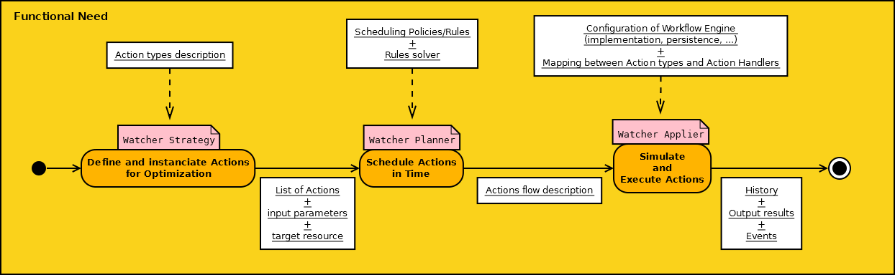

..
 This work is licensed under a Creative Commons Attribution 3.0 Unported
 License.

 http://creativecommons.org/licenses/by/3.0/legalcode

==================================================
Provide a more dynamic Actions management solution
==================================================

Include the URL of your launchpad blueprint:

https://blueprints.launchpad.net/watcher/+spec/watcher-add-actions-via-conf

Watcher aims at providing an open solution for auditing any pool of resources
and optimizing it through recommended `Actions`_.

This blueprint aims at providing a generic and dynamic system for adding new
Optimization actions that can be used in one or several Strategies to reach
the Goal_(s) of an `Audit`_.

Problem description
===================

Today, the set of possible `Actions`_ is fixed for a given version of Watcher
and enables optimization algorithms to include actions such as instance
migration, changing hypervisor state, changing power state (ACPI level, ...).

It should be possible to deploy and configure (in watcher.conf) new potential
Actions and associate each Action to a Python class, without the need to
redeploy a new version of Watcher.

Note that even if so far `Watcher Decision Engine`_ and `Watcher Applier`_ are
packaged in the same Python package, those services may be deployed on separate
machines. Beyond that, there will probably be a blueprint aiming at having the
`Watcher Planner`_ as a separate component (today it is included in the
Watcher Decision Engine).

This is the reason why, there should be a strong separation of concern
regarding:

* Action types definition (input parameters, ...)
* Actions instantiation of a given Action type
* Actions scheduling (through Action types scheduling policies, ...)
* Actions simulation and execution (through some Action handler class)

Each of these concerns are related to a specific `Bounded Context`_ and the
objective of this blueprint is to better address each Bounded Context
independently so that we can update the model and source code of a given
context without necessarily impacting the other contexts (Micro-Services
architecture).

Below you will find a diagram, showing the functional need regarding Actions
management in Watcher:

You can see that there is a need in Watcher for three main phases:

* The first phase named "**Define and instantiate Actions for Optimization**"
  takes place in the Strategies of the Watcher Decision Engine: each
  `Strategy`_ needs to be able to use and instantiate a set of pre-defined
  optimization Action types in order to achieve the goal of the `Audit`_.
  Those Actions are not scheduled within a timeframe at that point.

  During this phase, developers need to be able to do four things in their
  Strategy:

  * describe and register new types of Actions, with a dedicated Domain
    Specific Language (DSL). Each type of Action should have its own input
    parameters, name, description, version and target `resource type`_;
  * create one or several instances of these Action types (i.e. Watcher
    needs some kind of factory for Actions);
  * add these Actions to the recommended `Solution`_ as a simple unordered
    list of Actions;
  * persist this list of recommended Actions in the `Watcher Database`_.

* The second phase named "**Schedule Actions in Time**" takes place in the
  Watcher Planner: the Actions instantiated in the Strategy need to
  be scheduled so that they do not disturb the `SLA`_ and also because there is
  some logical order when executing the Actions. For example, you will
  disable an hypervisor before you start evacuating all instances from it (to
  make sure that the hypervisor does not receive new initial placement request
  from Nova). Therefore, the Watcher Planner must be able to take into
  account some scheduling policies/rules such as:

  * do not migrate too many virtual machines at the same time in order to avoid
    network congestion;
  * make sure there's no more virtual machines on a compute node before
    powering it off (for energy saving);
  * live migration is preferred to inactive migration;
  * ...

  As a result, during this phase of the Watcher processing, there should be an
  efficient and extensible way to define those scheduling policies/rules and
  there should be some implementation which can take them into account to
  produce the design of a flow of Actions describing the dependency chain
  between each Action (after Action A trigger Action B, ...).

  Ideally, the developer should be able to integrate a new "*rules solver*"
  which could be dynamically loaded in the Watcher Planner according to what
  is set in Watcher configuration files.

  Note that this scheduled flow of recommended Actions is what is named an
  `Action Plan`_ in the Watcher vocabulary.

  It should also be possible to define error recovery rules which define what
  must be done whenever an error occurs in the worklow (how many attempts must
  be done, how often, ...). It should be possible to define error recovery
  policies for a specific Action or for a wider scope (the whole flow or
  embedded flow).

  Both scheduling policies/rules and the design of the flow of Actions could
  rely on dedicated Domain Specific Languages (DSL) and on a specific "solver"
  which would be able to take into account those rules.

  Again, the developers need an easy way to persist scheduling policies/rules
  and the design of the flow of Actions in the `Watcher Database`_.

* The third phase named "**Simulate and Execute Actions**" takes place in the
  Watcher Applier: it consists in executing the flow of Actions built in
  phase two.
  This means that there should be some workflow engine system which is able to
  read the flow description (described with a DSL and stored in the
  Watcher Database), simulate the execution of this flow and if the
  simulation is successful, really execute all the Actions it contains
  in respect with the schedule (i.e. the dependency chain between Actions).

  This workflow engine should be able to load the implementation (named
  "**ActionHandler**") of each Action type and do the following:

  * first launch some simulation method which makes sure all pre-conditions are
    met before executing the real command and avoid useless rollbacks on the
    real OpenStack services. The simulation phase could also make sure that all
    **ActionHandler** implementations are present and that all
    `target resource`_ exist.
  * if pre-conditions are met, trigger some concrete command on technical
    components (most of the time, it will be OpenStack components such as Nova,
    Neutron,...).
  * handle error recovery rules

  In order to do the mapping between Action types used in phase 1 and 2 and
  **ActionHandler** classes, it must be possible for developer to implement
  a mapping system which would be loaded dynamically and configurable.

  The workflow engine should be able to create a current context of execution
  of the workflow which enables to take some output results from a previously
  executed Action and inject it as input parameters of the next upcoming
  Action. This context must be persisted in some database and the workflow
  engine should be able to resume an interrupted workflow (in the case the
  Watcher Applier service was stopped for example) from where it was
  stoppped and not restart it from the zero.

  Ideally, it should be possible for an operator with an admin role to browse
  the history of activity of the workflow engine (especially events and alarms
  regarding executed Actions).

  The workflow engine should be able to send some notifications (on the Watcher
  AMQP message bus) whenever the current state of an Action changes.

Use Cases
----------

As a developer.
I want to be able to create and use new optimization Actions_ in the
optimization Strategies_ (loaded in the `Watcher Decision Engine`_).
So that I can easily develop new Strategies (for a given optimization Goal_)
which rely on these actions to change the state of a managed resource and
without needing an upgrade of Watcher.

As a developer.
I want to be able to create workflows in the `Watcher Planner`_ containing
atomic actions and embedded workflows (made of several actions). Workflows may
schedule those actions in sequence or in parallel.
So that I can schedule optimization actions according to some scheduling
policies/rules.

As a developer.
I want to be able to develop scheduling policies/rules and dynamically add
those rules without needing an upgrade of Watcher.
So that I can control how actions are scheduled in a given timeframe.

As a developer.
I want to be able to provide new actions handlers as Python class which can be
loaded in the `Watcher Applier`_.
So that the Watcher Applier can launch concrete commands to the service
responsible for managing a resource (most of the time, it will be OpenStack
services such as Nova, Cinder, Neutron, ... but it can also be any resource
management service).

As an operator with an admin role.
I want to be able to easily install and configure new optimization actions
without needing to deploy a new version of the Watcher software.
So that they can be used for a new optimization Strategy that I need to
install

Project Priority
-----------------

Not relevant because Watcher is not in the big tent so far.

Proposed change
===============

Estimated changes are going to be in the following places:

* in the `Watcher Decision Engine`_:

  * in `Strategies`_
  * in the `Watcher Planner`_

* in the `Watcher Applier`_

As described in the `Problem description`_, Watcher
should integrate a new Task/Flow management system which provides a clear
separation between the three main phases:

* Define new optimization `Action`_ types and instantiate them in Strategies
* Schedule Actions in time
* Simulate and execute Actions

Alternatives
------------

We could deploy a new version of Watcher each time we need to add new Action
types but this would impact the availability of Watcher and would lead to a
much less evolutive and system.

Data model impact
-----------------

The following data object will probably be impacted:

* **Action**:

  * there may be some changes in the way we store input parameters
    of an `Action`_ (probably as an array of key-value pairs) and the unique id
    of the `target resource`_.
  * We may also need to store in the database the list of output values
    returned after the Action was executed by the Watcher Applier.

It may also be necessary to add some new data objects such as:

* **ActionType** which would contain all the information related to a certain
  type of Action:

  * **action_type**: the unique id of the Action type.
  * **action_type_version**: the version of the Action type. It would be
    provided with `SemVer`_ format.
  * **parameters**: an array of input parameters provided as tuples with the
    following fields: **(parameter_name, parameter_type)**. The
    **parameter_type** can be any simple type such as string, integer, boolean,
    float, ...
  * **target_resource_type**: the unique `resource type`_ that this Action
    type can change. It can be any `HEAT resource type`_.
  * **display_name**: a short human readable name for the Action type.
  * **display_description**: a long human readable description for the
    Action type.

REST API impact
---------------

There will be an impact on every REST resource URLs that starts with
**/v1/actions/** and that uses the type **Action**:

* GET /v1/actions/(action_uuid)
* POST /v1/actions
* PATCH /v1/actions
* GET /v1/actions/detail

The type **Action** will have new attributes mentionned in the previous
paragraph.

Please look at the `Actions handling in Watcher API`_.

If Watcher stores new data objects such as **ActionType**, it would be
necessary to provide new REST resource URLs for managing those objects with
CRUD operations.

Note that for creating a new **ActionType** with the API, the user may provide
the description of this **ActionType** in a file compliant with the DSL that
will be used for it (i.e. probably a JSON or YAML file).

Security impact
---------------

In the case a new Action needs to access an OpenStack service (for example,
Neutron), the **watcher** user under which Watcher Applier is running will
need to be declared as having a role with enough rights on this service to
trigger the concrete Action.

Notifications impact
--------------------

None

Other end user impact
---------------------

Aside from the API, here are there other ways a user will interact with this
feature:

* impact on **python-watcherclient**:

  * will need to find a new way to display the list of Actions and the
    detailed information about an Action.
  * will need to be able to handle new data objects such as **ActionType** as
    well

Performance Impact
------------------

None

Other deployer impact
---------------------

When delivering a new `Strategy`_, the operator will deploy the following
softwares:

* the main Python class implementing the `Strategy`_;
* the files containing the description of the needed `Actions`_ types (written
  in whatever DSL is appropriate for this);
* the files containing the description of the scheduling rules (written in
  whatever DSL is appropriate for this);
* the Python Planner class (Rules solver) that will be able to read the
  scheduling rules and generate a schedule of the Actions. Note that this is
  optional to deliver a new class here because the new Strategy may rely on
  a previously deployed Rules solver;
* the Python classes of each Actions handler needed in the Actions flow
  to simulate/execute in the Watcher Applier.

The operator will also need to change the Watcher configuration in order to
indicate:

* What `Watcher Planner`_ implementation will be used for scheduling Actions
* What **Watcher Actions Mapper** implementation will be used to do the mapping
  between Action types and Action handlers (i.e. Python class loaded by the
  `Watcher Applier`_).
* What implementation of the Workflow engine must be used to simulate and
  execute the Actions flow.
* What storage backend will be used by the Workflow engine used in the
  Watcher Applier to persist the current state of the Actions flow.

Developer impact
----------------

None

Implementation
==============

Assignee(s)
-----------

Primary assignee:
  jed56

Work Items
----------

The Watcher team should first study whether solutions like `TaskFlow`_ or
`Mistral`_ would fit the need. It would certainly avoid long rewriting of
source code and would even help us anticipate the future needs regarding
the management/scheduling of `Actions`_ in Watcher.

Here is the list of foreseen work items:

* Find an appropriate Domain Specific Language (DSL) for describing a new
  Action type in Watcher.
* Implement the factory which is able to instantiate Actions in the
  `Strategy`_ according to the Action type description.
* Put the `Watcher Planner`_ classes in a dedicated Python package (not in
  the `Watcher Decision Engine`_)
* Add a dynamic loading of the Watcher Planner implementation (via
  stevedore)
* Find a generic format to persist the description of the flow of Actions that
  will be generated by the `Watcher Planner`_ and loaded by the
  `Watcher Applier`_
* Provide a default implementation of the `Watcher Planner`_. This default
  implementation should be very simple and based on priority associated to each
  Action. Later, more complex implementations can be provided which would be
  able to read scheduling rules DSL. We may have to benchmark several existing
  Rules solver implementations.
* Add a dynamic loading of Actions handlers in the Watcher Applier (via
  stevedore).
* Integrate an existing Workflow engine which would be able to load and execute
  Actions handlers according to the design of the Actions flow produced
  by the Watcher Planner (i.e. what is called the `Action Plan`_)
* Add a simulation phase in the Watcher Applier in order to verify that
  the Actions flow can be executed without errors.
* Make sure errors are handled correctly whenever an Action fails during the
  simulation phase or during the real execution of the Actions flow in the
  Watcher Applier.

Dependencies
============

There are some dependencies with the following blueprints:

* In blueprint named "`Code refactoring using terms defined in our glossary`_",
  some classes related to this specification (meta-action, primitive, ...) will
  be renamed or moved to another package.
* We have to consider the existence of existing workflow management frameworks
  such as `TaskFlow`_: see blueprint
  https://blueprints.launchpad.net/watcher/+spec/use-taskflow

We should also have a look to other existing workflow management frameworks:

  * `Mistral`_: this OpenStack project proposes a Workflow as a service system
  * `PyUtilib`_: it's a self contained workflow engine, intended to be embedded
    and developed to automate the processing of scientific workflows.
  * `Spiff Workflow`_: a workflow engine implemented in pure Python
  * `hurry.workflow`_: a simple workflow system. It can be used to implement
    stateful multi-version workflows for Zope Toolkit applications.

Testing
=======

Unit tests will be needed for:

* the loading of the files containing the description of the needed `Actions`_
  types (written in whatever DSL is appropriate for this);
* the loading of files containing the description of the scheduling rules
  (written in whatever DSL is appropriate for this);
* the Python Planner class (Rules solver) that will be able to read the
  scheduling rules and generate a schedule of the Actions;
* the dynamic loading of an Action handler class inside the
  `Watcher Applier`_;
* the Python classes of each Actions handler needed in the Actions flow
  to simulate/execute in the Watcher Applier;
* the dynamic loading of a `Watcher Planner`_ implementation;
* the dynamic loading of a **Watcher Actions Mapper** implementation;
* the execution of the default provided Watcher Planner implementation
* the execution of the default provided **Watcher Actions Mapper**
  implementation;
* the configuration of different storage backends for the Workflow engine used
  in the Watcher Applier to persist the current state of the Actions
  flow.
* the execution of a simulation phase and the error management during this
  simulation phase

It will also be necessary to validate the whole Action management system in
the existing integration tests.

Documentation Impact
====================

The documentation will have to be updated, especially the glossary, in order to
explain the new concepts regarding `Actions`_ definition, scheduling and
execution.

The architecture description will also need to be updated because:

* the `Watcher Planner`_ will become independent from the
  `Watcher Decision Engine`_
* a new component will be introduced: the **Watcher Actions Mapper**
* many component implementations will be provided as plugins (Action types,
  Watcher Planner, **Watcher Actions Mapper**, **ActionHandler**)

The documentation regarding Watcher installation and configuration will also
need to be updated in order to explain:

* howto describe new Action types with the proposed DSL;
* howto deploy new Action types into Watcher;
* howto use new Action types in your optimization strategy (i.e. howto
  instantiate an Action from a given Action type);
* howto add new scheduling policies/rules in the `Watcher Planner`_;
* howto build flows of Actions using the proposed DSL;
* howto add a new Watcher Planner implementation;
* howto add a new **Watcher Actions Mapper** implementation;
* howto configure the `Watcher Applier`_: engine implementation, persistence
  backend, ...

References
==========

IRC discussions:

* Action point related to `TaskFlow`_: http://eavesdrop.openstack.org/meetings/watcher/2015/watcher.2015-12-09-13.59.html
* A lot of exchanges regarding Actions and Workflow management in the Git
  reviews related to the Watcher glossary: https://review.openstack.org/#/c/246370/

History
=======

None

.. _Actions handling in Watcher API: https://factory.b-com.com/www/watcher/doc/watcher/webapi/v1.html#actions
.. _SemVer: http://semver.org/
.. _stevedore: https://pypi.python.org/pypi/stevedore
.. _TaskFlow: https://wiki.openstack.org/wiki/TaskFlow
.. _Mistral: https://wiki.openstack.org/wiki/Mistral
.. _PyUtilib: https://software.sandia.gov/trac/pyutilib
.. _Spiff Workflow: https://github.com/knipknap/SpiffWorkflow/wiki
.. _hurry.workflow: https://pypi.python.org/pypi/hurry.workflow
.. _potential Action states: https://factory.b-com.com/www/watcher/doc/watcher/glossary.html#action
.. _Action: https://factory.b-com.com/www/watcher/doc/watcher/glossary.html#action
.. _Actions: https://factory.b-com.com/www/watcher/doc/watcher/glossary.html#action
.. _Action Plan: https://factory.b-com.com/www/watcher/doc/watcher/glossary.html#action-plan
.. _Audit: https://factory.b-com.com/www/watcher/doc/watcher/glossary.html#audit
.. _Solution: https://factory.b-com.com/www/watcher/doc/watcher/glossary.html#solution
.. _SLA: https://factory.b-com.com/www/watcher/doc/watcher/glossary.html#sla
.. _Strategy: https://factory.b-com.com/www/watcher/doc/watcher/glossary.html#strategy
.. _Strategies: https://factory.b-com.com/www/watcher/doc/watcher/glossary.html#strategy
.. _Watcher Applier: https://factory.b-com.com/www/watcher/doc/watcher/architecture.html#watcher-applier
.. _Watcher Decision Engine: https://factory.b-com.com/www/watcher/doc/watcher/architecture.html#watcher-decision-engine
.. _Watcher Planner: https://factory.b-com.com/www/watcher/doc/watcher/glossary.html#watcher-planner
.. _Watcher Database: https://factory.b-com.com/www/watcher/doc/watcher/architecture.html#watcher-database
.. _resource type: https://factory.b-com.com/www/watcher/doc/watcher/glossary.html#managed-resource-type
.. _target resource: https://factory.b-com.com/www/watcher/doc/watcher/glossary.html#managed-resource
.. _Code refactoring using terms defined in our glossary: https://blueprints.launchpad.net/watcher/+spec/glossary-related-refactoring
.. _Bounded Context: http://martinfowler.com/bliki/BoundedContext.html
.. _HEAT resource type: http://docs.openstack.org/developer/heat/template_guide/openstack.html
.. _goal: https://factory.b-com.com/www/watcher/doc/watcher/glossary.html#goal
