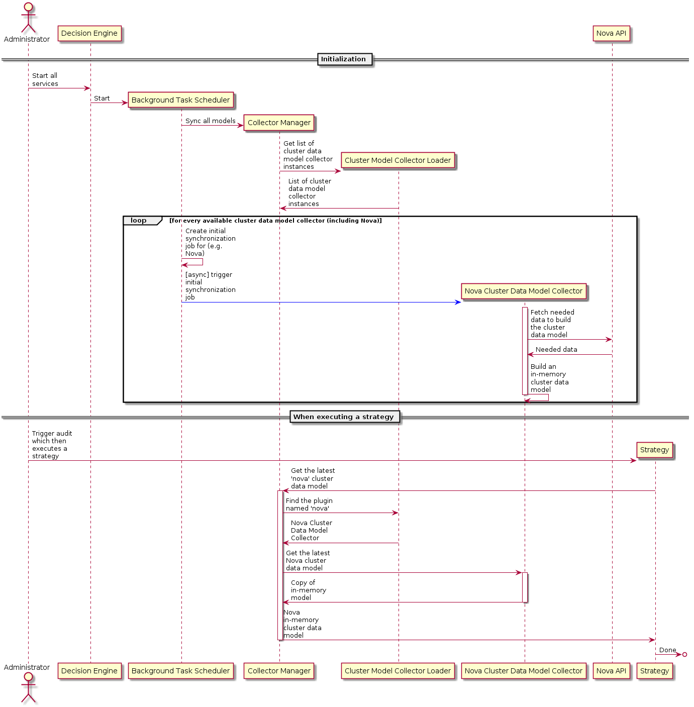
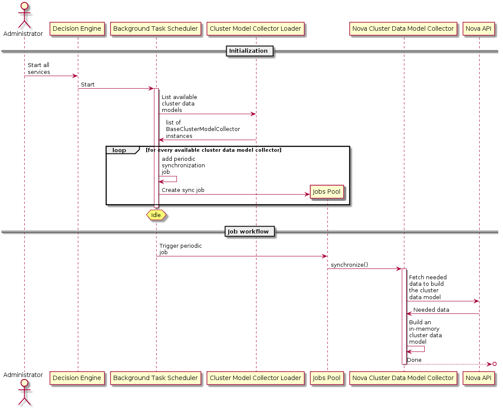
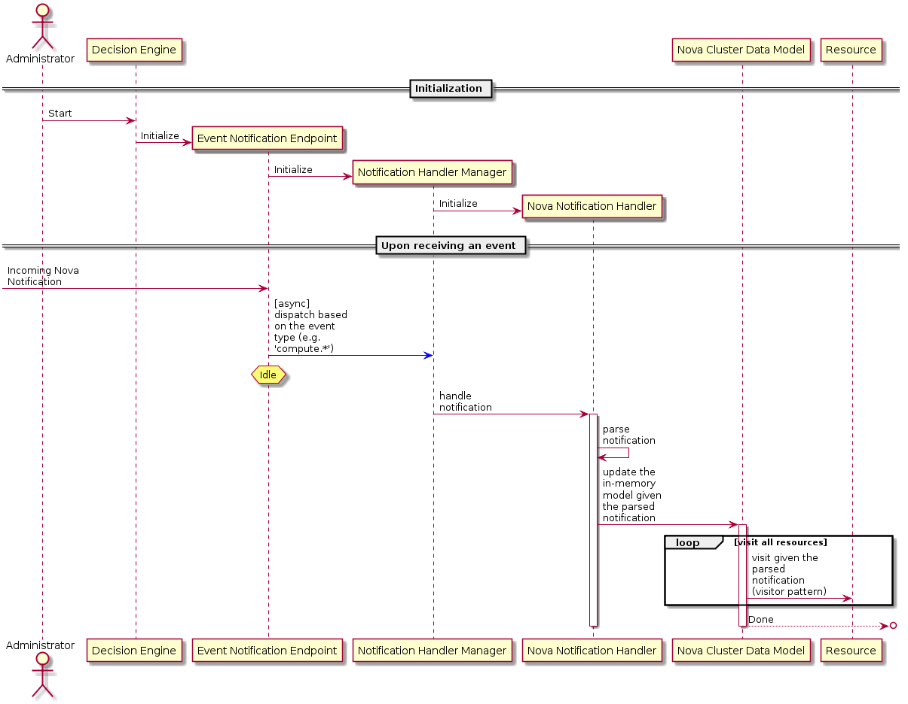

..
 This work is licensed under a Creative Commons Attribution 3.0 Unported
 License.

 http://creativecommons.org/licenses/by/3.0/legalcode

=============================
Cluster Model Objects Wrapper
=============================

https://blueprints.launchpad.net/watcher/+spec/cluster-model-objects-wrapper

Currently a model of the cluster is constructed every time a strategy is
executed, which will not scale in production or in larger environments. If
Watcher intends to be used by larger environments it needs a more robust way
to construct and maintain a model of the cluster. An in-memory cache of this
model can be built up and kept fresh via notifications from services of
interest in addition to periodic syncing logic.

Problem description
===================

As discussed above, Watcher currently constructs a model of the cluster every
time a strategy is executed via the ``get_latest_cluster_data_model()``
method. As it stands today Watcher only has one model collector defined
(``NovaClusterModelCollector``). This method then fetches all hypervisors from
Nova using the nova API and then for each hypervisor fetches all servers on
that hypervisor. For each of these hypervisors and servers, a Watcher model
object is created to represent the entity from the JSON response of the API.
These objects are placed into a collection (the cluster data model) which is
then passed to the strategy's ``execute()`` method. The strategy then uses
this model to make certain decisions.

Unfortunately, in a production environment of a decent size, constructing the
cluster model like this will not scale. Consider an environment with hundreds
of compute nodes and tens of thousands of servers. If Watcher needs to
construct the representation of this every time a user wants to run an audit,
running an audit will potentially be very slow. Also consider a busy
environment where a lot of audits are being requested in short succession -
Watcher will need to construct this most recent cluster model via API requests
to each service of interest, which is a lot of strain on the overall system
for almost no gain, assuming the environment has hardly changed between each
audit request.

It would be ideal that a strategy can use an in-memory cache of the cluster
model in order to make informed decisions immediately without the need for
Watcher to query every service for its most recent representation. This will
be especially important when continuous audits are implemented, which will
require decisions will be made periodically and often.

Use Cases
----------

The primary use case of this is addressing problems of scale. Strategies can
be executed much quicker due to minimal delay in constructing the cluster
model, which will result in faster audits delivered to the end users of
Watcher. It will also reduce load on the overall OpenStack deployment due to
the elimination of redundant API requests.

For the developers of Watcher, this will create an easy way to fetch and
consume the current cluster model.

Project Priority
-----------------

High

Proposed change
===============

Watcher should provide a number of cluster model collectors (reusing the
``BaseClusterModelCollector`` class) that are responsible for maintaining an
in-memory cache of their associated cluster. For example, the
``NovaClusterModelCollector`` class would maintain a cache of all hypervisors
and servers on each hypervisor. In the future this may expand to say a
``CinderClusterModelCollector`` class which would maintain a cache of all
storage providers and block devices (e.g., volumes).

These cluster model collectors would be managed by the existing
``CollectorManager`` class today, which will need to be updated to maintain
references to instantiations of each collector class instead of instantiating
a new one on every call to ``get_cluster_model_collector()``. Methods should
also be added to allow fetching the list of available collectors and fetching
specific collectors.

Each implementation of the ``BaseClusterModelCollector`` would continue to
provide a method analogous to the current ``get_latest_cluster_data_model``,
but instead of fetching the model from the service itself it would fetch it
from its internal cache.

Here below is a sequence diagram depicting the workflow to be used in order to
retrieve all the cluster data model:

Each implementation of the ``BaseClusterModelCollector`` should begin
populating its in-memory cache on instantiation, preferably without blocking
other code execution for quick service stand-up. The implementations should
also define periodic tasks that are responsible for (preferably asynchronously
through the use of threads) syncing the cache with the service. For example,
for ``NovaClusterModelCollector``, this periodic task would be responsible
for making an API request to Nova to fetch all hypervisors and servers. From
the response of that API request, the cache would be updated as appropriate.
The rate at which these sync up tasks are ran should be configurable, but a
sensible default is likely in the every 60 minute range.

Here below is a sequence diagram depicting the workflow to periodically
synchronize all the cluster data models:

If the periodic sync up tasks are the only method of updating the cache,
clearly the cache would quickly become stale. In order to combat this, a
notification handler will need to be put in place that asynchronously handles
notifications from different services that come in over the AMQP message bus.
The notification handler should be able to configure what notifications it is
interested in so that it can ignore any other notifications on the bus. The
notification handler would determine what type of notification it is handling,
then based on that it will spawn a thread that calls a method within specific
model collectors that are configured to be interested in notifications of said
type. The notification (including the payload) would be passed to the method,
which would be responsible for updating its collector's cache appropriately.
It is important the notification handler can deal with notifications
asynchronously via threads so that it does not get bogged down when the rate
of notifications is high. For example, in the case of Nova, the notification
handler would be able to receive notifications such as:

  * 'compute.instance.create.end' for instances being created
  * 'compute.instance.delete.end' for instances being deleted
  * 'compute.instance.live_migration._post.end' for instances being migrated
  * ... and dozens more

Here below is a sequence diagram depicting the workflow to update cluster data
models after receiving a notification:

Note that a single notification will not prompt the entire cluster model to be
refreshed - only the relevant items in the cache will be refreshed.

The notification handler should preferably have a way for exploiters of
Watcher to somehow be able to handle other notifications via some sort of
plugin mechanism.

The idea is that the notification handler will allow the collectors to keep
their cache predominantly up to date. If the notification handler fails to
receive any notifications sent by the services over the AMQP message bus for
whatever reason, then the periodic sync up task will serve to correct any
staleness of the cache. This boils down to the following idea: Watcher can
live with eventual consistency.

Alternatives
------------

No caching at all could be done in the collectors, as is today. As discussed
at length above, this would only be acceptable for the smallest of cloud
environments.

Instead of an in-memory cache, the cached data could be stored in Watcher
database tables. This would ultimately mean duplication of potentially a lot
of data which is a very big negative.

Data model impact
-----------------

This should not affect the database as the data is being kept within in-memory
caches.

REST API impact
---------------

None, unless we intend on surfacing Watcher's current representation of the
cluster, but that is likely outside the scope of this.

Security impact
---------------

None

Notifications impact
--------------------

Watcher will not be generating any new notifications, but it will be consuming
many more.

Other end user impact
---------------------

None besides better performance and the understanding of what eventual
consistency means.

Performance Impact
------------------

This is described in the "Proposed change" section, but as an overview:

  * Improved performance for environments of scale since the cluster model
    does not need to be reconstructed as part of every audit request.

  * Periodic tasks to sync up cluster model data can potentially be very slow.
    Therefore they should be done asynchronously preferably.

  * Notification handler will need to handle a significant number of
    notifications coming from the AMQP message bus. Spawning threads to the
    cluster model collectors to do the actual cache updates should allow
    control to quickly return to the handler to handle the next notification.

Other deployer impact
---------------------

Several config options for the rate at which the periodic sync up tasks will
need to be added. The intention is that the default values should work well
in real deployments.

This change will take immediate effect after it is merged - it will be part of
Watcher's core architecture.

Developer impact
----------------

Strategies may need to have some refactoring done to handle the new cluster
data models.

Implementation
==============

Assignee(s)
-----------

Primary assignee:
  Vincent Françoise <Vincent.FRANCOISE@b-com.com>

Other contributors:
  Taylor Peoples <tpeoples@us.ibm.com>

Work Items
----------

Part 1
^^^^^^

- Enhance the ``BaseClusterModelCollector`` to allow the creation of plugins:

  + Make ``BaseClusterModelCollector`` inherit from the ``Loadable`` abstract
    class.

- Implement a ``ClusterModelCollectorLoader`` which extends the
  ``DefaultLoader`` class so we can dynamically load user-defined cluster data
  model collectors.

- Make ``CollectorManager`` capable of loading entry points/plugins that will
  be the various cluster model collectors (i.e. ``NovaClusterModelCollector``
  only for now but also ``CinderClusterModelCollector`` later on).

  + Add a ``loader`` attribute that will be a ``ClusterModelCollectorLoader``
    instance.
  + Adapt all existing strategies to now explicit the fact that we use the
    `Nova`_ cluster model collector.
  + Add a ``get_collectors()`` method that returns a mapping of all the entry
    point names with their associated ``BaseClusterModelCollector`` instances .

Part 2
^^^^^^

- Enhance the ``BaseClusterModelCollector`` to allow an in-memory model
  synchronization:

  + Make it inherit from ``oslo_service.service.Singleton`` so we only maintain
    a single model per type.
  + Add a ``cluster_data_model`` abstract property which shall have to return
    a ``ModelRoot`` instance which will have to be thread-safe.
  + Modify the ``get_latest_cluster_data_model()`` abstract method to now be a
    plain method that will have to return a deep copy of its in-memory
    ``cluster_data_model``.
  + Add a ``synchronize()`` abstract method that will be responsible for
    fetching the full representation of the given cluster data model. This new
    cluster data model should be a drop-in replacement. Note: this
    ``synchronize()`` method should be executed asynchronously.
  + Implement the  ``cluster_data_model`` property for
    ``NovaClusterModelCollector``.
  + Implement the ``synchronize()`` method for ``NovaClusterModelCollector``.

- Implement a ``BackgroundTaskScheduler`` background scheduling service using
  `apscheduler`_ that will be responsible for periodically triggering a job per
  cluster data model in order to synchronize them. This scheduling service
  should be launched as part of the ``Watcher Decision Engine`` daemon.

  + It should inherit from both ``oslo_service.service.ServiceBase`` and
    ``apscheduler.schedulers.background.BackgroundScheduler``.
  + Make use of ``oslo_service.service.Services`` in order to run both
    ``BackgroundTaskScheduler`` and the main decision engine service within
    the same process.
  + The period will have to be configurable via the configuration file.
  + A set of basic configuration options about this scheduling service should
    also be exposed.

- Update the ``Watcher Decision Engine`` command to now launch the

Part 3
^^^^^^

- Create a ``NotificationHandlerManager`` class that will be responsible for
  dispatching any incoming notification to update the model using the
  observer pattern.

  + Define a ``register()`` method that will be used to register all the
    notification handlers.
  + Implement a ``dispatch()`` method that will be responsible to call
    the right notification handler using an internal registry based on
    their associated publisher ID. This method should execute notification
    handlers asynchronously.

- Create a ``NotificationHandler`` abstract class that will be responsible
  for processing any given notification to update the model.

  + Implement a ``handle()`` method that will be responsible to call
    the right registered handler method based on the content of the
    notification
  + Define a ``get_publisher_id()`` class method that will be used to
    associate the ``NotificationHandler`` to a given publisher (
    e.g. '^compute.\*').
  + Implement an ``NotificationParser`` abstract class that will be responsible
    for parsing incoming raw notifications.

    * Create a ``parse()``  abstract method that will be responsible for
      converting the incoming raw notification into some Watcher notification
      objects which shall be different for all event type.

  + Using the visitor pattern, explore the in-memory model and apply the
    associated change wherever needed:
  + Implement a ``NovaNotificationHandler`` class extending the
    ``NotificationHandler`` base class:

      * Define handler methods for all the notifications defined by
        `Nova`_ (see this `list of notifications`_).
      * Use the ``event_type`` attribute of the Nova notifications as the main
        dispatching criterion.
      * Register it against the ``NotificationHandlerManager``.
      * Add a ``model_collector`` property that will be return the right
        ``BaseClusterModelCollector`` singleton.

- Enhance the ``BaseClusterModelCollector`` to allow the collection and
  processing of notifications in order to maintain the consistency of the
  in-memory model over time:

  + Add a ``notification_handler`` abstract property to
    ``BaseClusterModelCollector`` which shall have to be overridden to return
    a ``NotificationHandler`` instance.
  + Make the ``notification_handler`` property of ``NovaClusterModelCollector``
    return a ``NovaNotificationHandler`` instance.

- Make ``CollectorManager`` able to find all the notification handlers:

  + Add a ``get_notification_handlers()`` class method to ``CollectorManager``
    so that it returns a list of all the ``NotificationHandler`` instances
    via

- Implement an ``EventsNotificationEndpoint`` class that will be responsible
  for subscribing to a given notification topic in order to collect and format
  them:

  + Make ``CollectorManager`` able to find all the notification handlers via
    ``get_collectors()`` and their associated ``notification_handler``.

.. _Nova: http://docs.openstack.org/developer/nova/
.. _list of notifications: https://github.com/openstack/nova/blob/master/nova/rpc.py#L222-L336
.. _apscheduler: https://github.com/agronholm/apscheduler

Dependencies
============

None

Testing
=======

Existing tempest tests should provide basic coverage. The bulk of the changes
will affect larger environments. If those cannot be obtained for testing,
some sort of simulation and analysis of the performance needs to be done.

Documentation Impact
====================

Documentation for the new configuration options will be needed. The notion of
all of this data being cached by Watcher in memory will also need to be
documented.

References
==========

None

History
=======

None
