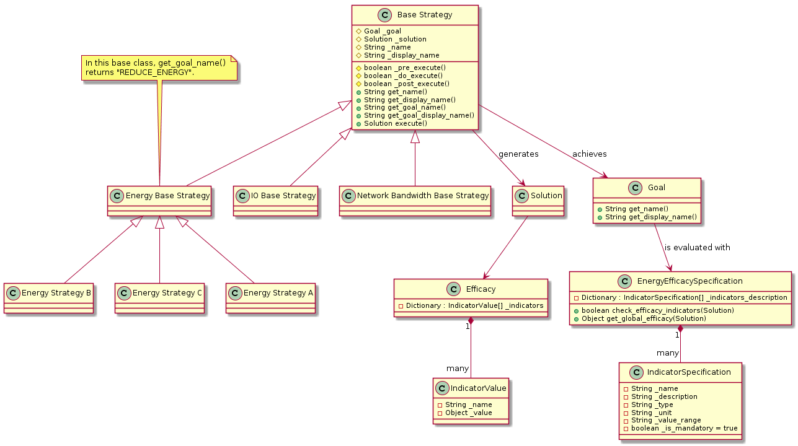

..
 This work is licensed under a Creative Commons Attribution 3.0 Unported
 License.

 http://creativecommons.org/licenses/by/3.0/legalcode

==================
Efficacy Indicator
==================

https://blueprints.launchpad.net/watcher/+spec/efficacy-indicator

Provide efficacy indicators associated with an `Audit`_ to give tangible
indicators of the possible improvement of the proposed optimization.

When the `Administrator`_ trigger an audit using Watcher, we provide a list of
`Actions`_ that should be run to attain a specific `goal`_ (defined in the
`audit template`_).
Today, there is no incentive to give a predicted result of the optimization
after running the `action plan`_. This feature will give the admin an
estimated gain of running Watcher on its infrastructure.

Problem description
===================

Today, Watcher does not provide efficacy indicators to give more accuracy to
an action plan. An administrator would require to have an idea of the level
of optimization Watcher can provide. The indicators must be related to the
initial goal set in the audit template, for example if the goal is "thermal
optimization", we should provide an estimated average inlet temperature of the
cluster (or an estimated decrease in % of the average inlet temperature).
These indicators must be computed by the chosen strategy.

In later versions of Watcher, there should also be a way to compare the
efficacy of different `Strategies`_ for a given optimization `goal`_.
Therefore, all the strategies associated to a given goal should provide the
same efficacy indicators so that the `Administrator`_ can decide which strategy
is the best.

In an even longer run, it will enable Watcher to automatically decide:

* which strategy to use (via some *StrategySelector* component in the
  `Watcher Decision Engine`_). See `Strategy Selector blueprint`_.
* or which planner implementation is the most efficient. See
  `Planner Selector blueprint`_.

Use Cases
----------

As an administrator, I would like to have efficacy indicators to be able to
judge if the proposed optimization fit my objectives before running the
recommended action plan.

As an administrator, I would like to be able to compare in a fair way the
efficacy of several strategies for the same optimization goal

As a strategy developer, I will provide a list of indicators that can be
evaluated during the execution of the audit and displayed to the administrator
with the corresponding action plan.

As a developer, I would like to make sure that all strategies associated to
a given goal provide the same list of efficacy indicators.

As an administrator, I would like to be able to update a given goal and its
associated optimization strategies. In that case, all the previously launched
audits and action plans which are still in recommended or pending state should
be cancelled (in order to make it clear that the estimated efficacy indicators
are not relevant anymore and that a new audit should be launched with the new
deployed version).

Project Priority
-----------------

Not relevant because Watcher is not in the big tent so far.

Proposed change
===============

A dictionary should be added to the `action plan`_ providing a list of efficacy
indicators with a name and a value (the name is used as the key for each
indicator and should be unique).

The same dictionary should also be added to the `solution`_ generated by
each `Strategy`_ (which contains a non scheduled list of actions).

We propose to use the `DDD Specification Pattern`_ to express the constraints
regarding efficacy indicators for a given `goal`_.

For each XYZ `goal`_, we should create a **XYZEfficacySpecification** class
which contains the list of expected efficacy indicators. This class would
contain the following properties for each expected efficacy indicator:

- the name of the indicator, which must be translated via i18n oslo lib
- a description, which must be translated via i18n oslo lib
- the unit of the indicator (percent, kWh, second, ...), which must be
  translated via i18n oslo lib
- the type of the value (integer, float, enum, string, ...) and range of
  allowed values.
- a flag indicating whether it is mandatory or optional

Each strategy associated to a given XYZ goal should have access to a
singleton of the **XYZEfficacySpecification** class in order to make sure
the generated solution contains the expected efficacy indicators. In other
words, in each strategy, it should be possible to call the
**check_efficacy_indicators(Solution)** method of the
**XYZEfficacySpecification** which returns a boolean saying whether all
mandatory efficacy indicators are provided in a given `solution`_ and
whether the indicator values are compliant with the expected types and ranges
(we may rely on `Voluptuous Python data validation library`_ to manage the
schema definition and validation of indicators).

It should be possible to call a **get_global_efficacy(Solution)** method from
the **XYZEfficacySpecification** class (or directly from the **XYZGoal** class)
which returns a global score of efficacy for a given `solution`_. This global
score would be computed using a weighted sum of the different efficacy
indicators.

For example, for the **BASIC_CONSOLIDATION** goal, the following efficacy
indicators would be returned:

- **nb_migrations**: the number of virtual machine migrations
- **nb_empty_nodes**: the number of empty nodes (i.e. where all the virtual
  machines have been migrated to some other machines).

And the global score of efficacy would be computed with the following formula:

::

  global_score = (nb_empty_nodes/nb_migrations*100)

Of course, in this case, we should handle the case when **nb_migrations** is 0.

Note that for simpler implementation, it is also possible to put directly these
methods in the **XYZGoal** class (which would then act as the specification
class for the XYZ goal efficacy).

Note also that whenever a **XYZGoal** class is updated, Watcher should
automatically change to a **CANCELLED** state the previously generated audit
and action plans . This would make sure that we can handle the consistency
between the indicators described in the goal and those returned in the
`action plan`_. See `State machine diagrams`_ for more details on the different
possible states of the audit or an action plan objects.

All those efficacy indicators are set in the **_post_execute()** method of the
strategy, i.e. just after a `solution`_ has been found in the **_do_execute()**
method.

Note that the **_pre_execute()** method of each strategy will be the place
where all necessary data is fetched and prepared in order to compute a
`solution`_ (i.e. build a model of the data-center, get some previously
stored metrics, ...).

Below you will find a class diagram showing the hierarchy of `Strategies`_ for
several goals and how they are related to efficacy specification classes:

In the future, the `DDD Specification Pattern`_ will enable Watcher to compose
several efficacy indicators whenever an Audit is launched with multiple goals.

Alternatives
------------

The administrator will let Watcher do the optimization without having a
forecast of the potential gain on the infrastructure.

Data model impact
-----------------

The following data object will be impacted:

* **ActionPlan**:

  * We may need to store in the database a list of efficacy indicators
    associated with the action plan

A new **Goal** object should be stored in the Watcher database with the
following information:

  * the unique name of the goal
  * the translated name of the display name of the goal
  * the list of efficacy indicator descriptions. Note that the regarding the
    name, unit and description of each indicator, the database stores the i18n
    unique name of the string, not the translated version.

A new table should also be created in order to store the specification of each
efficacy indicator and reference the goal that uses it.

REST API impact
---------------

There will be an impact on every REST resource URLs that starts with
**/v1/action_plans/** and that uses the type **ActionPlan**:

* GET /v1/action_plans
* GET /v1/action_plans/(action_plans_uuid)
* POST /v1/action_plans
* DELETE /v1/action_plans
* PATCH /v1/action_plans
* GET /v1/action_plans/detail

The type **ActionPlan** will contain a new **efficacy** object with a
dictionary of indicators.

Here is a sample of the new JSON payload for an action plan which includes
one global efficacy indicator and three detailed indicators:

::

  {
      "action_plans": [
          {
              "audit_uuid": "abcee106-14d3-4515-b744-5a26885cf6f6",
              "first_action_uuid": "57eaf9ab-5aaa-4f7e-bdf7-9a140ac7a720",
              "links": [
                  {
                      "href": "http://localhost:9322/v1/action_plans/9ef4d84c-41e8-4418-9220-ce55be0436af",
                      "rel": "self"
                  },
                  {
                      "href": "http://localhost:9322/action_plans/9ef4d84c-41e8-4418-9220-ce55be0436af",
                      "rel": "bookmark"
                  }
              ],
              "state": "ONGOING",
              "updated_at": "2016-02-08T12:59:33.445869",
              "uuid": "9ef4d84c-41e8-4418-9220-ce55be0436af",
              "global_efficacy": 89,
              "efficacy_indicators" : [
                  {
                      "name" : "Average CPU load",
                      "value" : "22"
                  },
                  {
                      "name" : "Average inlet temperature",
                      "value" : "34"
                  },
                  {
                      "name" : "Number of sleeping hosts",
                      "value" : "2"
                  }
              ]
          }
      ]
  }

There will also be an impact on every REST resource URLs that starts with
**/v1/goals/** and that uses the type **Goal**:

* GET /v1/goals
* GET /v1/goals/(goal_uuid)
* GET /v1/goals/detail

Each **Goal** object will be a dictionary with a **goal_name** and an
**efficacy_specification** which contains an array of indicator
descriptions.

Here is a sample of the new JSON payload for a goal which includes
the **efficacy_specification** object composed of four indicators:

::

  {
      "goals": [
          {
              "goal_name": "REDUCE_ENERGY",
              "goal_display_name": "Reduce Energy Consumption",
              "efficacy_specification" : [
                  {
                      "name" : "Relative energy gain",
                      "description" : "The amount of gained energy in %",
                      "unit" : "%",
                      "type" : "integer",
                      "range" : "[0..100]",
                      "mandatory" : "true"
                  },
                  {
                      "name" : "Absolute energy gain",
                      "description" : "The amount of gained energy in kWh",
                      "unit" : "kWh",
                      "type" : "long",
                      "mandatory" : "true"
                  },
                  {
                      "name" : "Number of VM migrations",
                      "description" : "The total number of VM to migrate",
                      "unit" : "counter",
                      "type" : "integer",
                      "mandatory" : "true"
                  },
                  {
                      "name" : "Estimated action plan duration",
                      "description" : "The estimated time needed to execute the
                      action plan, in seconds",
                      "unit" : "second",
                      "type" : "long",
                      "mandatory" : "true"
                  }
              ]
          }
      ]
  }

Note that, from the user point of view, the link between indicators returned in
the **Goal** object and in the **ActionPlan** object can be done through the
name of the indicator (which is unique for a given `goal`_).

Security impact
---------------

None

Notifications impact
--------------------

None

Other end user impact
---------------------

Efficacy indicators needs to be added to the python-watcherclient to provide
extra information when requesting action plans or goals.

The indicators must also be added to watcher-dashboard to allows the cloud
administrator to take appropriate decision in Horizon.

Performance Impact
------------------

The calculation of efficacy indicators will be done by the targeted
strategy, we should keep in mind that this calculation must not add delay to
the building of the `solution`_.

Other deployer impact
---------------------

None

Developer impact
----------------

None

Implementation
==============

Assignee(s)
-----------

Primary assignee:
  <launchpad-id or None>

Other contributors:
  v-mahe, jed56, acabot

Work Items
----------

Here is the list of foreseen work items:

* add a new **Goal** object in **/watcher/db/sqlalchemy/models.py**
* add a new **EfficacyIndicatorSpecification** object in
  */watcher/db/sqlalchemy/models.py**
* add a new **goal.py** class in the **/watcher/objects/** package
* add a dictionary to **BaseSolution** and **ActionPlan** classes to store the
  list of efficacy indicator values.
* the **ActionPlan** class should be able to read/write the efficacy indicator
  values from/to the `Watcher database`_ (see **/db/api.py** and
  **/db/sqlalchemy/api.py** classes).
* the **BaseSolution** class should have a new method named
  **set_efficacy_values()** which enables a `Strategy`_ to set the list of
  efficacy indicator values in the `solution`_ that it builds.
* implement an example of efficacy specification class which contains a
  description of the expected efficacy indicators for a given goal and the
  needed methods:

  - **check_efficacy_indicators(Solution)** which returns a boolean. The
    developer may use the `Voluptuous Python data validation library`_ to
    define the constraints on the efficacy indicators in this method.
  - **get_global_efficacy(Solution)** which returns the computed global
    efficacy value.
* implement a base class dedicated to a goal that will hold a list of possible
  `Strategies`_ and an efficacy specification.
* when the `Watcher Decision Engine`_ service is started, Watcher should
  browse the list of available goal unique names, get for each goal the list of
  efficacy indicator descriptions and store them in the `Watcher database`_.
* make sure that when a new version of a goal is deployed, when the
  `Watcher Decision Engine`_ service is restarted, all recommended and pending
  action_plan and audit are changed to a **CANCELLED** state.
* update all existing strategies so that they define three private methods
  which are automatically called from the public **execute()** method (i.e. use
  a `Template method design pattern`_):

  - **_pre_execute()**: which prepares the data needed by the optimization
    algorithm.
  - **_do_execute()**: which computes the `solution`_. This is where the main
    optimization algorithm is executed and where the efficacy indicators are
    computed.
  - **_post_execute()**: which can do some cleaning task but, more importantly,
    **this is where efficacy indicators are set**.

* update the Watcher devstack plugin setup to adapt it (remove the auto
  watcher_goals config setup).
* update **python-watcherclient** to provide extra information regarding
  efficacy indicators when requesting action plans or goals.

Dependencies
============

There are some dependencies with the following blueprints:

* https://blueprints.launchpad.net/watcher/+spec/get-goal-from-strategy :
  there should be a common base class **XYZBaseStrategy** for all `Strategies`_
  associated to the same **XYZGoal**.
* https://blueprints.launchpad.net/watcher/+spec/optimization-threshold : this
  blueprint deals with input parameters provided to `Strategies`_ and there
  may be some common impacts with this blueprint which deals with output
  parameters generated by `Strategies`_.
* https://blueprints.launchpad.net/watcher/+spec/persistent-audit-parameters :
  this blueprint must be implemented so that it is possible to get from the
  database the information regarding the goal and strategy to which the
  indicators of the action plan were related (hence the specification of these
  indicators) when the audit was launched.
* `Strategy Selector blueprint`_ : this component will probably use the
  efficacy indicators to automatically select the best strategy.
* `Planner Selector blueprint`_ : this component will probably use the
  efficacy indicators to automatically select the best scheduler.

There is also a dependency with the following bug:

* https://bugs.launchpad.net/watcher/+bug/1546630 : the API documentation
  should explain how to request the list of available goals and for each goal
  it should be possible to see the list of efficacy indicators.

Testing
=======

* Unit tests on the `Watcher Decision Engine`_
* Tempest test to run a strategy to get efficacy indicators
* Tempest test to get the list of available goals and for each goal the list
  of efficacy indicator specification.
* An admin should be able to launch an Audit with Watcher with a
  BASIC_CONSOLIDATION goal on an OpenStack cluster and get efficacy
  indicators associated with the generated action plan.

Documentation Impact
====================

The developer guide should explain how to specify efficacy indicators for a
given goal.

References
==========

History
=======

None

.. _Audit: https://factory.b-com.com/www/watcher/doc/watcher/glossary.html#audit
.. _Administrator: https://factory.b-com.com/www/watcher/doc/watcher/glossary.html#administrator
.. _Actions: https://factory.b-com.com/www/watcher/doc/watcher/glossary.html#action
.. _goal: https://factory.b-com.com/www/watcher/doc/watcher/glossary.html#goal
.. _audit template: http://factory.b-com.com/www/watcher/doc/watcher/glossary.html#audit-template
.. _action plan: https://factory.b-com.com/www/watcher/doc/watcher/glossary.html#action-plan
.. _solution: https://factory.b-com.com/www/watcher/doc/watcher/glossary.html#solution
.. _Strategy: https://factory.b-com.com/www/watcher/doc/watcher/glossary.html#strategy
.. _Strategies: https://factory.b-com.com/www/watcher/doc/watcher/glossary.html#strategy
.. _Watcher Decision Engine: https://factory.b-com.com/www/watcher/doc/watcher/architecture.html#watcher-decision-engine
.. _Watcher database: https://factory.b-com.com/www/watcher/doc/watcher/architecture.html#watcher-database
.. _DDD Specification Pattern: http://martinfowler.com/apsupp/spec.pdf
.. _Voluptuous Python data validation library: https://github.com/alecthomas/voluptuous
.. _Template method design pattern: https://en.wikipedia.org/wiki/Template_method_pattern
.. _Planner Selector blueprint: https://blueprints.launchpad.net/watcher/+spec/watcher-planner-selector
.. _Strategy Selector blueprint: https://blueprints.launchpad.net/watcher/+spec/watcher-strategy-selector
.. _State machine diagrams: https://factory.b-com.com/www/watcher/doc/watcher/architecture.html#state-machine-diagrams
