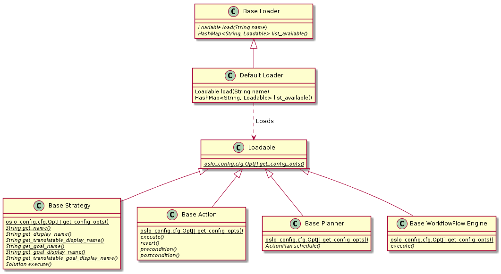
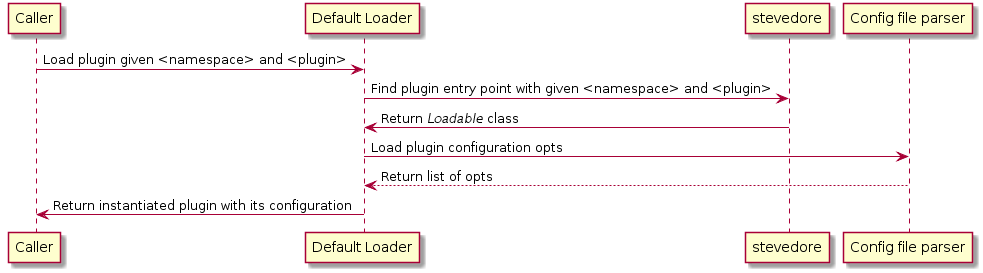
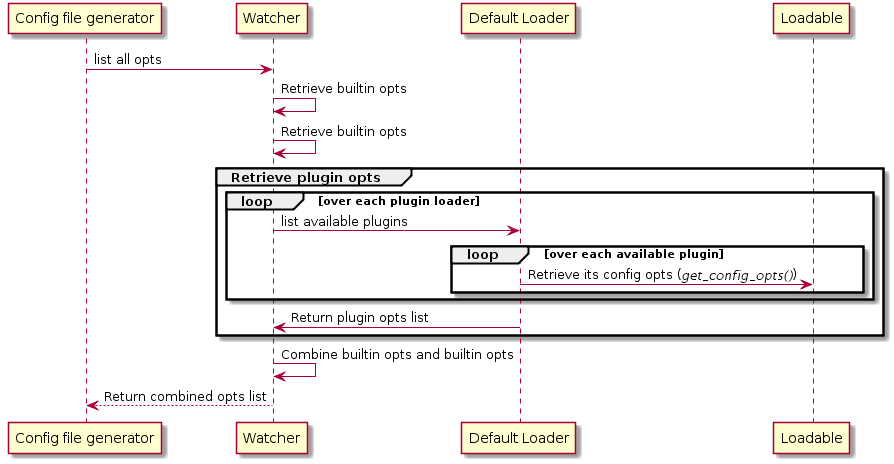

..
 This work is licensed under a Creative Commons Attribution 3.0 Unported
 License.

 http://creativecommons.org/licenses/by/3.0/legalcode

==================================================================
Allow the developer of a Watcher plugin to add specific parameters
==================================================================

https://blueprints.launchpad.net/watcher/+spec/plugins-parameters

In Watcher, it is possible to deploy and configure new strategies, actions,
planners, etc. and associate each "plugin" to a Python class, without having
to redeploy a new version of Watcher.

However, it should be possible to pass some extra parameters depending of the
configuration of the OpenStack cluster or some behaviour (e.g. timeout,
weights, etc.) on which Watcher is operating.

This is the reason why, we should give the possibility to the developer to add
some parameters depending on the configuration of OpenStack cluster on the
plugins.

Problem description
===================

As of now, all plugins that a developer implements are loaded as plain old
Python classes before being instantiated. Hence, this means that Watcher does
not pass down anything more than hardcoded parameters. So if a developer
currently wants to define a set of configuration options specific to its own
plugin, he/she would have to manually declare them. This way of doing things
causes the following problems:

- No standard way of declaring configuration options increases the difficulty
  for an administrator to configure Watcher:

  * The generated configuration file would miss out these parameters which will
    further increase the configuration complexity.
  * How to find where these parameters are without looking at the code?

- Every plugin developer has to code the same logic declare and fetch these
  options.

Hence, Watcher should provide a way to ease the process of declaring and
fetching extra options depending on the configuration of the OpenStack cluster
or some behaviour (e.g. timeout, weights, workers, etc.) on which Watcher is
operating whilst keeping things simple from an administrator viewpoint.

This is the reason why we should provide to the developer a standard way to
both declare and fetch configuration options so that whenever the administrator
generates the Watcher configuration sample file, it contains the configuration
options of the plugins that are currently available.

Use Cases
----------

As a developer,
I want to be able to specify a set of configuration options for my plugin
So that I can allow an administrator to adapt/tune the behaviour of my plugin
given the configuration of an OpenStack cluster.

As an administrator,
I want to be able to access and modify the configuration options of all
available plugins
So that I can adapt/tune their behaviour the requirements of my OpenStack
cluster.

As an administrator,
I want to be able to generate a configuration file that includes the options
provided by each available plugin
So that I can understand how to use each one of them without having to look at
the codebase.

Project Priority
-----------------

Not relevant because Watcher is not in the big tent so far.

Proposed change
===============

Here below is the class diagram outlining the changes that will have to be made
in order to support the addition of configuration options:

Moreover, all plugins are currently instantiated by the ``DefaultLoader`` when
its ``load()`` is being called. This method should be improved so it also fetch
the configuration provided by the plugin using the ``get_config_opts()``
abstract class method that every plugin class should implement. The latter
method needs to be an class method so that when Watcher will collect the
configuration of each plugin, there will be no need to instantiate them.

In order to expose these plugin parameters to the administrator, we also have
to auto-discover them when we use the configuration file generator which is
triggered either during the generation of the Watcher documentation or manually
with the ``tox -e config`` command:

In order to be able to achieve the process described in the above sequence
diagram, here below is a recap of the changes that will have to be made:

- Make each plugin provide a class method named ``get_config_opts()`` that
  will define all its configuration options.
- Update the ``list_opts()`` function so that it also collects the
  configuration options from all the available plugins so that generating the
  configuration file via the ``tox -e config`` command includes them in its
  configuration sample file.

The administrator would then have adapt this configuration sample file to
the requirements of any given OpenStack cluster.

Alternatives
------------

Instead of using a ``Loadable`` abstract class, we do it by convention.
Indeed, the main solution relies on a ``Loadable`` abstract base class that
defines the ``get_config_opts()`` method. But instead, we could use the duck
typing to say that by convention, every plugin should implement a
``get_config_opts()`` without having to enforce it codewise.
This alternative would mean less code but would also be more error-prone for
the plugin developer.

Data model impact
-----------------

None

REST API impact
---------------

None

Security impact
---------------

None

Notifications impact
--------------------

None

Other end user impact
---------------------

None

Performance Impact
------------------

None

Other deployer impact
---------------------

New configuration sections and options will be added to the Watcher
configuration file. Hence, the administrator should be aware of them.
This also mean that the documentation should be updated to encourage the plugin
developer to provide a detailed description of every single configuration
option that gets declared.

Developer impact
----------------

None

Implementation
==============

Assignee(s)
-----------

Primary assignee:
  vincent-francoise

Other contributors:
  david-tardivel

Work Items
----------

- Implement the ``Loadable`` abstract class

  + Add an abstract class method named ``get_config_opts()`` with should return
    a list of ``oslo_config.cfg.Opt`` instances.

- Make the following classes inherit from ``Loadable`` abstract class:

  + ``BaseStrategy``
  + ``BaseAction``
  + ``BasePlanner``
  + ``BaseWorkflowFlowEngine``

- For each of the above, provide a default implementation of
  ``get_config_opts()`` that returns an empty list which should be the default
  behaviour.

- Enhance the ``load()`` method of the ``DefaultLoader`` class to now also load
  the configuration options that relates to the plugin we want to load and
  inject them into the loaded plugin upon instantiating it.

Dependencies
============

* https://blueprints.launchpad.net/watcher/+spec/get-goal-from-strategy

Testing
=======

* Add needed unit tests to cover the new functionality introduced by this
  blueprint
* Update the broken unit tests

Documentation Impact
====================

Update all plugin implementation documentations to now mention that
configuration options can be specified via the ``get_config_opts()`` method.

References
==========

None

History
=======

None
