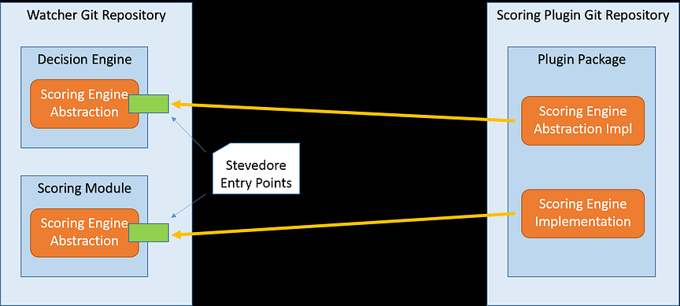

..
 This work is licensed under a Creative Commons Attribution 3.0 Unported
 License.

 http://creativecommons.org/licenses/by/3.0/legalcode

======================================
 Provide a scoring module for Watcher
======================================

https://blueprints.launchpad.net/watcher/+spec/scoring-module

`Watcher Decision Engine`_ currently allows to define multiple `Goals`_ and
implement several `Strategies`_ to reach them. However, in some more advanced
scenarios, `Strategies`_ might use machine learning models, which can be
trained and evaluated using external machine learning engines.

This blueprint aims at providing a generic scoring engine module, which will
standarize interactions with scoring engines through the common API. Also,
it will be possible to use the scoring engine by different `Strategies`_, which
will improve the code and data model re-use.

The scoring module will be independent and optional. There is no need for any
`Strategy`_ to use it.

Problem description
===================

Today, the `Strategy`_ implementation is free to use any algorithm or any
external framework in order to achieve a given `Goal`_. There is no standard
interface or API which would help to share these algorithms or frameworks
between different `Strategies`_.

It should be possible to implement scoring engines independently from
`Strategies`_. Once implemented prediction or classifier could be shared and
re-used allowing to implement more advanced `Strategies`_, which could even use
multiple scoring engines.

Use Cases
---------

As a developer.
I want to be able to list the available Scoring Engines. So that I can quickly
identify them and reuse the available predicted results in my strategy, e.g.
prediction energy consumption of the VMs, predicted CPU of the VMs, etc.

As a developer.
I want to be able to create and use Scoring Engines in the optimization
`Strategies`_. So that I can quickly switch the Scoring Engine or implement
multiple versions of the same Scoring Engine (e.g. created using a different
data set for learning).

As a developer.
I want to be able to configure multiple Scoring Engines without needing an
upgrade of Watcher.

As a developer.
I want to be able to provide a dynamic list of Scoring Engines in a single
plug-in. So that I can register/unregister similar types of Scoring Engines
without restarting any Watcher service.

As a developer.
When implementing a new `Strategy`_ I want to work with different Scoring
Engines (possibly from different vendors) in a similar way, using similar
API.

As a developer.
I want to get metadata information about a given Scoring Engine. The metadata
might contain an important information how to work with a specific Scoring
Engine, for example: number of input parameters (e.g. number of features),
the response format (e.g. label order used by classifier).

Project Priority
----------------

Not relevant because Watcher is not in the big tent so far.

Proposed change
===============

The proposal is to define an abstraction layer in the `Decision Engine`_,
which will provide an abstract ScoringEngine class, which will have to be
implemented by all Scoring Engines and a ScoringFactory class, which will be
used by a `Strategy`_ implementation to select a Scoring Engine to work with.

Usage scenarios
---------------

The most basic scenario is presented on the following diagram:

It's important to notice that Scoring Engines might have different
requirements and the implementations might vary. Some of them might be
implemented as plain Python classes executing (possibly heavy) calculations.
In these cases it makes a sense to delegate the execution to Watcher Scoring
module, which will be a new Watcher service, similar to `Watcher Decision
Engine`_ or `Watcher Applier`_:

Some other Scoring Engines might be implemented using external frameworks or
even live entirely in the cloud, exposing only some API to work with them.
In this scenario, the abstraction layer will simply delegate work to these
external systems (e.g. using some HTTP client libraries), as illustrated on
the diagram below:

Implementation details
----------------------

This above an impact on the design of the Scoring Module and its
implementation. The goal of the abstraction layer proposed above is to allow
for both:

* Simple usage of any Scoring Engine by any `Strategy`_.
* Implementation freedom: if a Scoring Engine performs some heavy
  calculations, its implementation could be moved to external process, which
  will not affect the `Watcher Decision Engine`_ module.

That said, the following changes are going to be implemented:

* In the watcher/common package:

  ScoringEngine class defining an abstract base class for all Scoring
  Engine implementations. The abstract class will include the following
  abstract methods:

  :get_engine_id:
    Method will return a unique string identifier of the Scoring Engine.
    This ID will be used by factory classes and `Strategies`_ wanting to
    use a specific Scoring Engine

    :Input:
      none

    :Result:
      unique string ID (must be unique across all Scoring Engines)

  :get_model_metadata:
    Method will return a map with metadata information about the data
    model. This might include informations about used algorithm, labels
    for data returned by the score method (useful for interpreting the
    results)

    :Input:
      none

    :Result:
      dictionary with metadata, both keys and values as strings

      For example, the metadata can contain the following information (real
      world example):

      * scoring engine is a classifier, which is based on the learning data
        with these column labels (last column is the result used for
        learning): [MEM_USAGE, PROC_USAGE, PCI_USAGE, POWER_CONSUMPTION,
        CLASSIFICATION_ID]
      * during the learning process, the machine learning decides that it
        actually only needs these columns to calculate the expected
        CLASSIFICATION_ID: [MEM_USAGE, PROC_USAGE]
      * because the scoring result is a list of doubles, we need to know
        what it means, e.g. 0.0 == CLASSIFICATION_ID_2, 1.0 ==
        CLASSIFICATION_ID_1, etc.
      * there is no guarantee of the order of the columns or even the
        existence of them in input/output list
      * this information must be passed as metadata, so the user of the
        scoring engine is able to "understand" the results
      * in addition, the metadata might provide some insights like what was
        the algorithm used for learning or how many training records were
        used

  :calculate_score:
    Method responsible for performing the actual scoring, such as
    classifying or predicting data

    :Input:
      list of float numbers (e.g. feature values)

    :Result:
      list of float numbers (e.g. classified values, predicted results)

* In the `Watcher Decision Engine`_:

  * New scoring package containing:

    * ScoringFactory class defining a factory for Scoring Engine
      implementations.
    * engines subpackage containing implementations of the Scoring Engines.
      The Scoring Engines must all extend the ScoringEngine base class.
    * Two sample Scoring Engine implementations:

      * simple Scoring Engine working within `Decision Engine` module.
      * simple Scoring Engine using the Scoring Module, which will demonstrate
        how to defer the heavy calculations to the external Python process.

  * In `Strategies`_: two sample `Strategies`_ using the above Scoring
    Engines.

* In the `Watcher API`_:

  * New REST resource URLs to expose list of Scoring Engines and their
    metadata (read-only)

    * GET /v1/scoring_engines/
    * GET /v1/scoring_engines/(scoring_engine_uuid)

* In the Watcher CLI:

  * Expose new API in the command line

* New Watcher Scoring Module:

  * New top level scoring_engine directory inside watcher directory with
    Watcher source code.
  * A new service: watcher-scoring.
  * A sample Scoring Engine (not using any external dependencies).

Deployment
----------

The deployment model for Scoring Engine implementations will use the Stevedore
pluggability model. There will be entry points defined for the abstraction
layer and for the Watcher Scoring module as well. The abstraction layer part
will be required to implement, whether the Watcher Scoring module part will be
optional (it's not needed for example when using external analytics platforms
running in the cloud).

In addition, it will be possible to register multiple Scoring Engines from a
single plug-in. The Scoring Engine list will also be dynamic, meaning that it
will be possible to register and unregister a Scoring Engine without any need
to restart Watcher services.

Scoring Engine versioning
-------------------------

The rules similar to API versioning should apply to Scoring Engine versioning.
Scoring Engines will be identified using their unique ID. A new version of the
Scoring Engine should have a different ID, so it doesn't break the existing
usage. Of course it's possible that the Scoring Engine developer will decide
to update the existing Scoring Engine (so ID of the updated version will stay
the same), but then she/he should take the full responsibility for that and
understand the fact, that it might change the other use cases. The
recommendation is to update Scoring Engines only for small bug fixing and give
a new ID to the Scoring Engines using different ML algorithm or trained using
different learning data.

Alternatives
------------

Each developer could implement a new `Strategy`_ using a custom integration
with machine learning frameworks. Data Models and Scoring Engines are
relatively difficult and time consuming to create, so it would be a big loss
if they are not available for wider usage.

Data model impact
-----------------

None

REST API impact
---------------

None

Security impact
---------------

There will be a new Watcher Scoring Module service, which means an additional
network port open, which is always increasing the security impact.

Notifications impact
--------------------

None

Other end user impact
---------------------

None

Performance Impact
------------------

None

Other deployer impact
---------------------

When delivering a new Scoring Engine, the operator will deploy the following
softwares:

Required:

* the main Python class implementing the Scoring Engine
* all additional resources or classes required by the new Scoring Engine
  implementation (for example client code to communicate with external service
  if a Scoring Engine is implemented and hosted in the cloud)

Optional:

* `Strategy`_ implementation, which is using the new Scoring Engine (details
  are out of scope of this document)
* `Action`_ handlers if they are required by the `Strategy`_ (details are out
  of scope of this document)

Developer impact
----------------

None

Implementation
==============

Assignee(s)
-----------

Primary assignee:
  tkaczynski

Work Items
----------

The list of foreseen work items:

* Review this BluePrint, improve it based on feedback received
* Implement generic Watcher Scoring Module
* Implement Scoring Engine loader
* Implement a sample Scoring Engine to demonstrate Scoring Module design
  and provide a guidance how to use it (no external dependencies)
* Implement a sample `Strategy`_ using sample Scoring Engine from previous
  point
* Provide documentation of the new Scoring Module

  * Update glossary with terms related to Watcher Scoring
  * Provide a guidance / tutorial how to implement a Scoring Engine plugin

Dependencies
============

There are no direct dependencies.

However, in the long run Watcher should provide a flexible plugin model, which
would allow to easily integrate Scoring Engines, `Strategies`_ and `Actions`_
with Watcher without needing to reinstall or upgrade it. The ideal scenario
would be that the third party developers would provide implementations in a
separate repository, which could then be included in one of the Watcher
configuration files. Solving this problem is not in scope of this document.

Testing
=======

Unit tests will be needed for the code in the new Scoring Module. Implementing
this module will be transparent for the existing Watcher code base, so no
existing tests or functionality will be affected.

Documentation Impact
====================

The documentation will have to be updated, especially the glossary, in order to
explain the new concepts regarding Scoring Module definition and Scoring Engine
implementations.

The API documentation and Watcher User-Guide will have to be updated to
demonstrate how to get information about available Scoring Engines and their
metadata.

The architecture description will also need to be updated because there will
be a new Watcher component available.

The documentation regarding Watcher installation and configuration will also
need to be updated in order to explain:

* howto deploy new Scoring Engines into Watcher
* howto integrate `Strategies`_ with existing Scoring Engines

References
==========

None

History
=======

None

.. _Action: https://factory.b-com.com/www/watcher/doc/watcher/glossary.html#action
.. _Actions: https://factory.b-com.com/www/watcher/doc/watcher/glossary.html#action
.. _Action Plan: https://factory.b-com.com/www/watcher/doc/watcher/glossary.html#action-plan
.. _Audit: https://factory.b-com.com/www/watcher/doc/watcher/glossary.html#audit
.. _Decision Engine: https://factory.b-com.com/www/watcher/doc/watcher/architecture.html#watcher-decision-engine
.. _Goal: https://factory.b-com.com/www/watcher/doc/watcher/glossary.html#goal
.. _Goals: https://factory.b-com.com/www/watcher/doc/watcher/glossary.html#goal
.. _SLA: https://factory.b-com.com/www/watcher/doc/watcher/glossary.html#sla
.. _Solution: https://factory.b-com.com/www/watcher/doc/watcher/glossary.html#solution
.. _Strategy: https://factory.b-com.com/www/watcher/doc/watcher/glossary.html#strategy
.. _Strategies: https://factory.b-com.com/www/watcher/doc/watcher/glossary.html#strategy
.. _Watcher API: https://factory.b-com.com/www/watcher/doc/watcher/webapi/v1.html
.. _Watcher Applier: https://factory.b-com.com/www/watcher/doc/watcher/architecture.html#watcher-applier
.. _Watcher Decision Engine: https://factory.b-com.com/www/watcher/doc/watcher/architecture.html#watcher-decision-engine
.. _Watcher Planner: https://factory.b-com.com/www/watcher/doc/watcher/glossary.html#watcher-planner
